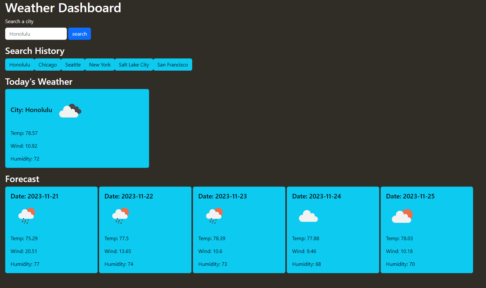

# Weather Dashboard
#### by Jensen James Saoit 

## Description
Web app that shows the current weather and forecast for the next 5 days. It also stores your recently searched cities to your local storage and allow you to re-search them with a simple click.

## Preview

## Table of Contents
* [Installation](#installation)
* [Usage](#usage)
* [Credits](#credits)
* [License](#license)

## Installation
Pull the repository and open the HTML file through your preferred browser

## Usage
Simply type any city in the search bar, it will display the current weather and the forecast up to 5 days. For example, I am going to visit my family in Hawaii and I'm having trouble deciding what to pack. So I use this web app to check the forecast and see that it's going storming a bunch in Honolulu, now I know to pack accordingly based on the weather.

## Credits
Name: Jensen James Saoit
E-mail: saoitjensen@gmail.com
Github: jensenjamessaoit
Colaborators: N/A

## License
This project is licensed under [MIT](https://opensource.org/license/mit/).